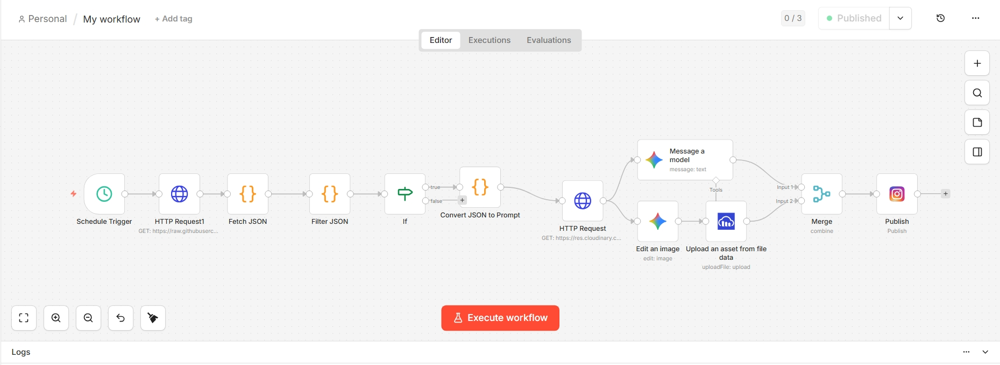
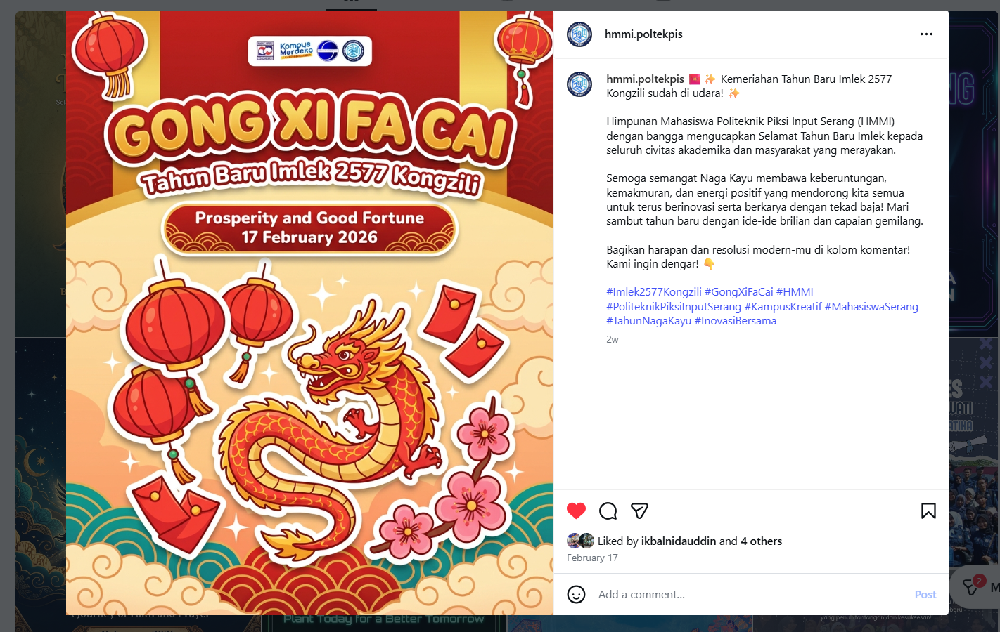

# 🤖 Automated Instagram Poster Generator (n8n + Gemini)

This repository contains an **n8n automation workflow** that automatically generates and publishes social media posters for important events or national holidays.

The workflow automatically:

1. Fetches holiday/event data from a JSON source
2. Filters events occurring **today**
3. Generates a **poster design using Google Gemini**
4. Generates an **Instagram caption**
5. Uploads the generated image to **Cloudinary**
6. Publishes the post automatically to **Instagram**

This automation was built for the official social media account of:

**Himpunan Mahasiswa Manajemen Informatika (HMMI)**  
Politeknik Piksi Input Serang

---

# 🧠 Workflow Overview

The automation runs on a scheduled trigger and performs the following pipeline:

```

Schedule Trigger
│
▼
Fetch Event JSON
│
▼
Filter Today's Event
│
▼
Generate Design Prompt
│
▼
Generate Poster (Gemini Image Edit)
│
▼
Generate Caption (Gemini)
│
▼
Upload Image to Cloudinary
│
▼
Merge Image + Caption
│
▼
Publish to Instagram

```

---

# 🖼️ Workflow Screenshot

Below is the visual workflow inside **n8n**.



---

# 🎨 Example Output

Example poster generated automatically by the workflow:



---

# ⚙️ Requirements

To run this workflow you will need:

- **n8n (self-hosted recommended)**
- Google Gemini API
- Cloudinary account
- Instagram Graph API access

---

# 🔑 Required Credentials

The workflow uses the following credentials inside n8n:

| Service | Purpose |
|------|------|
| Google Gemini API | Generate poster and caption |
| Cloudinary API | Store generated images |
| Instagram Graph API | Publish post automatically |

⚠️ **Important:**  
Credentials are **not included** in this repository.  
You must configure them manually in your n8n instance.

---

# 📦 Setup Guide

### 1. Import Workflow

Open n8n → Import workflow → upload:

```

workflow.json

```

---

### 2. Configure Credentials

Add these credentials inside n8n:

- Google Gemini API
- Cloudinary API
- Instagram API

Then connect them to the corresponding nodes.

---

### 3. Update Data Source

The workflow fetches event data from a JSON file:

```

hari-besar.json

````

Example structure:

```json
[
{
"holiday_name": "Hari Pendidikan Nasional",
"holiday_acronym": "HARDIKNAS",
"holiday_symbol": "education",
"date": "02 May 2026",
"tagline": "Pendidikan untuk masa depan bangsa"
}
]
````

---

### 4. Activate Workflow

Enable the workflow to run automatically using the **Schedule Trigger**.

---

# 🧩 Features

✅ Fully automated social media content generation
✅ AI-generated posters
✅ AI-generated captions
✅ Scheduled posting
✅ Instagram integration
✅ Cloud image storage

---

# 🚀 Use Cases

This workflow is ideal for:

* Student organizations
* Universities
* Social media teams
* Event-based content automation
* AI content pipelines

---

# 🛠️ Built With

* **n8n**
* **Google Gemini**
* **Cloudinary**
* **Instagram Graph API**

---

# 📜 License

MIT License

Feel free to use, modify, and improve this workflow.

---

# ⭐ Contribute

If you improve this workflow, feel free to submit a pull request or share your ideas.

Automation should make life easier 🚀
